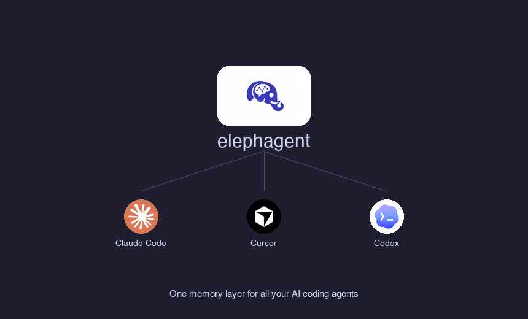
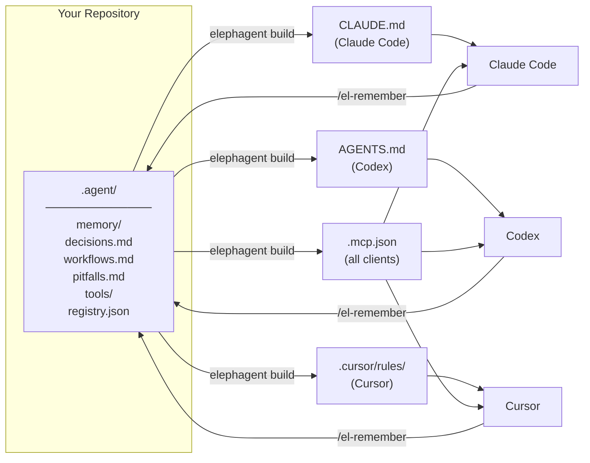

<p align="center">
  
</p>

<h1 align="center">elephagent</h1>

<p align="center">One memory layer for all your AI coding agents — <em>elephants never forget.</em></p>

<p align="center">
  <a href="https://pypi.org/project/elephagent/"></a>
  <a href="https://pypi.org/project/elephagent/"></a>
  <a href="LICENSE"></a>
  <a href="https://www.python.org/"></a>
  
</p>

English | [中文](README.zh.md)

<p align="center">
  
</p>

---

## The Problem

You use Claude Code, Cursor, and Codex. Each stores project knowledge in a different place. Switch machines, add a teammate, or try a new agent — and you start from scratch.

| | Without elephagent | With elephagent |
|---|---|---|
| **Memory location** | Scattered across `CLAUDE.md`, `.cursor/rules/`, `AGENTS.md` | One `.agent/` directory, auto-synced to all platforms |
| **Switch tools** | Re-teach every agent from scratch | All agents share the same memory instantly |
| **New teammate** | Copy-paste tribal knowledge | `git clone` and everything is there |
| **MCP servers** | Configure separately in each tool | Register once, available everywhere |

---

## How It Works

`elephagent` stores everything in one Git-synced `.agent/` directory and renders the config files each tool already knows how to read. Your AI agents can also read and write memory directly via a built-in MCP server.



---

## Getting Started

### 1. Install

```bash
pip install elephagent
```

### 2. Talk to your AI agent (recommended)

Open your project in **Claude Code**, **Cursor**, or **Codex** and use these commands:

| Command | What happens |
|---|---|
| `/el-init-memory` | Sets up `.agent/` and generates all platform files |
| `/el-remember <note>` | Saves a note to shared memory |
| `/el-import` | Imports existing memories and skills from other platforms |
| `/el-sync-memory` | Commits and pushes memory to Git |
| `/el-check-memory` | Runs a health check on the setup |
| `/el-handoff` | Summarizes current session before switching tools |
| `/el-add-skill` | Creates a new shared skill |

> **Cursor note:** Open the project folder in Cursor — it auto-detects the `agent-memory` MCP server. Enable it in **Settings → Cursor Settings → MCP** if prompted.

### 3. Or use the CLI

```bash
# Initialize in your project (auto-runs `git init` if needed)
elephagent init

# Add a memory note
elephagent remember "This repo uses pnpm. Redis is required for API tests."

# Import existing memories and skills from other platforms
elephagent import

# Verify the setup
elephagent doctor

# Before syncing, create a repo at https://github.com/new (private recommended),
# then add it as the remote:
# git remote add origin https://github.com/you/your-repo.git

# Commit and push memory to Git
elephagent sync -m "update memory"
```

---

<p align="center">
  
</p>

---

## Built-in Skills

elephagent ships seven skills that work across Claude Code, Cursor, and Codex.

| Skill | Trigger phrases | What it does |
|---|---|---|
| `/el-init-memory` | "init memory", "set up agent memory" | Bootstrap `.agent/` and generate platform files |
| `/el-remember` | `/el-remember <note>` (slash command) | Save a note from the conversation to shared memory |
| `/el-check-memory` | "check memory", "memory status", "doctor" | Health-check the memory setup |
| `/el-sync-memory` | "sync memory", "push memory" | Build → commit → push to Git |
| `/el-add-skill` | "add skill \<name\>" | Create a new shared skill |
| `/el-import` | "import memories", "import skills", "import from cursor" | Import existing memories and skills from other platforms |
| `/el-handoff` | "handoff", "switch to cursor", "save context" | Summarize current session to shared memory before switching tools |

---

## CLI Reference

| Command | Description |
|---|---|
| `elephagent init` | Bootstrap `.agent/` and generate all platform files |
| `elephagent remember "..."` | Append a note and rebuild |
| `elephagent build` | Regenerate all adapter files from `.agent/` |
| `elephagent import` | Import memories and skills (supports `--from`, `--path`, skill names) |
| `elephagent doctor` | Check that everything is in sync |
| `elephagent sync -m "msg"` | Build → pull → commit → push |
| `elephagent tool list` | List registered MCP servers |
| `elephagent tool add <name>` | Register a new MCP server |

### Importing from existing setups

Already have a `CLAUDE.md`, `.cursor/rules/`, or custom skills? Import them in one command:

```bash
# Auto-detect and import everything (memories + skills from all platforms)
elephagent import

# Import from a specific platform
elephagent import --from claude
elephagent import --from cursor
elephagent import --from codex

# Import specific skills by name (searches ~/.cursor/skills/ and ~/.claude/skills/)
elephagent import my-skill another-skill

# Import skills from a custom directory
elephagent import --path /path/to/skills
```

In **auto** mode, elephagent scans:
- Project-local files: `CLAUDE.md`, `.cursor/rules/`, `AGENTS.md`
- Global skill directories: `~/.cursor/skills/`, `~/.claude/skills/`

Only hand-written content is imported — files generated by `elephagent build` are automatically skipped. Existing files in `.agent/` are never overwritten.

### Adding MCP tools

```bash
# stdio server
elephagent tool add context7 --command npx --arg -y --arg @upstash/context7-mcp

# HTTP server with token from env
elephagent tool add figma \
  --url https://mcp.figma.com/mcp \
  --bearer-token-env-var FIGMA_OAUTH_TOKEN
```

---

## Built-in MCP Server

`elephagent` ships a small MCP server at `.agent/tools/mcp_server.py` that lets agents read and write shared memory directly through the MCP protocol.

| Tool | Description |
|---|---|
| `agent_memory_read` | Read one or all memory files |
| `agent_memory_search` | Search across all memory |
| `agent_memory_append` | Append a durable note |
| `agent_tool_registry` | Read the shared MCP registry |

---

## Why Git?

- Memory travels with the repo, not the machine.
- Works in CI, on new laptops, with new teammates.
- Full history and diffs for every memory change.
- No third-party service required.

---

## Security

Never commit secrets into `.agent/`. Use environment variable references instead:

```bash
elephagent tool add internal-api \
  --url https://example.com/mcp \
  --bearer-token-env-var INTERNAL_API_TOKEN
```

`.agent/.gitignore` excludes local scratch files and secret-looking filenames by default.

---

## Roadmap

- [x] Git-synced shared memory
- [x] Auto-generated adapters for Claude Code, Cursor, Codex
- [x] Built-in MCP server
- [x] Shared MCP tool registry
- [x] Built-in skills for Claude Code, Cursor, Codex
- [x] Importers for existing Claude / Cursor / Codex memories and skills
- [ ] Python SDK (`import elephagent`)
- [ ] Memory compaction for large histories
- [ ] `pipx` / Homebrew packaging
- [ ] GitHub Action for CI validation

---

## Contributing

Issues and PRs are welcome. Before submitting, run:

```bash
elephagent build
elephagent doctor
python3 - <<'PY'
from pathlib import Path
for path in ["elephagent.py", ".agent/tools/mcp_server.py"]:
    compile(Path(path).read_text(), path, "exec")
    print(path, "ok")
PY
```

---

## License

[MIT](LICENSE)
