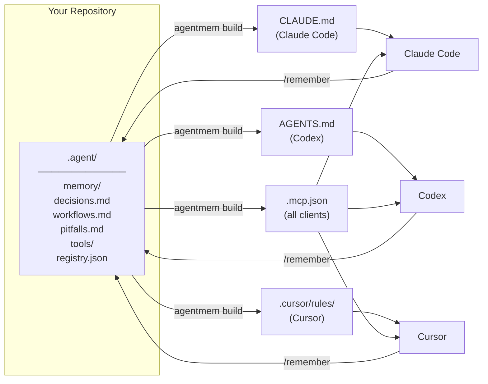

# agentmem

> One memory layer for all your AI coding agents.

[](https://pypi.org/project/agentmem/)
[](LICENSE)
[](https://www.python.org/)
[]()

English | [中文](README.zh.md)

---

## The Problem

You use Claude Code, Cursor, and Codex. Each stores project knowledge in a different place. Switch machines, add a teammate, or try a new agent — and you start from scratch.

## How It Works

`agentmem` stores everything in one Git-synced `.agent/` directory and renders the config files each tool already knows how to read. Your AI agents can also read and write memory directly via a built-in MCP server.



---

## Installation

```bash
pip install agentmem
```

Or with pipx (recommended for global CLI tools):

```bash
pipx install agentmem
```

---

## Quick Start

### Option A — Just talk to your AI agent (recommended)

If you use **Claude Code** or **Cursor**, you don't need to type any commands. Just say:

| What you say | What happens |
|---|---|
| `init memory` | Sets up `.agent/` and generates all platform files |
| `/remember <note>` | Saves a note to shared memory (use the slash command) |
| `sync memory` | Commits and pushes memory to Git |
| `check memory` | Runs a health check on the setup |
| `add skill <name>` | Creates a new shared skill |

> **Note:** Use `/remember` as a slash command rather than natural language — phrases like "remember this" may be intercepted by the AI agent's built-in memory system.

### Option B — CLI

```bash
# Initialize in your project
agentmem init

# Add a memory note
agentmem remember "This repo uses pnpm. Redis is required for API tests."

# Rebuild all adapter files
agentmem build

# Verify the setup
agentmem doctor

# Commit and push memory to Git
agentmem sync -m "update memory"
```

---

## Built-in Skills

agentmem ships five skills that work across Claude Code, Cursor, and Codex — no commands needed.

| Skill | Trigger phrases | What it does |
|---|---|---|
| `/init-memory` | "init memory", "set up agent memory" | Bootstrap `.agent/` and generate platform files |
| `/remember` | `/remember <note>` (slash command) | Save a note from the conversation to shared memory |
| `/check-memory` | "check memory", "memory status", "doctor" | Health-check the memory setup |
| `/sync-memory` | "sync memory", "push memory" | Build → commit → push to Git |
| `/add-skill` | "add skill \<name\>" | Create a new shared skill |

---

## All CLI Commands

| Command | Description |
|---|---|
| `agentmem.py init` | Bootstrap `.agent/` and generate all platform files |
| `agentmem.py remember "..."` | Append a note and rebuild |
| `agentmem.py build` | Regenerate all adapter files from `.agent/` |
| `agentmem.py doctor` | Check that everything is in sync |
| `agentmem.py sync -m "msg"` | Build → pull → commit → push |
| `agentmem.py tool list` | List registered MCP servers |
| `agentmem.py tool add <name>` | Register a new MCP server |

### Adding MCP tools

```bash
# stdio server
python3 agentmem.py tool add context7 --command npx --arg -y --arg @upstash/context7-mcp

# HTTP server with token from env
python3 agentmem.py tool add figma \
  --url https://mcp.figma.com/mcp \
  --bearer-token-env-var FIGMA_OAUTH_TOKEN
```

---

## Built-in MCP Server

`agentmem` ships a small MCP server at `.agent/tools/mcp_server.py` that lets agents read and write shared memory directly through the MCP protocol.

| Tool | Description |
|---|---|
| `agent_memory_read` | Read one or all memory files |
| `agent_memory_search` | Search across all memory |
| `agent_memory_append` | Append a durable note |
| `agent_tool_registry` | Read the shared MCP registry |

---

## Why Git?

- Memory travels with the repo, not the machine.
- Works in CI, on new laptops, with new teammates.
- Full history and diffs for every memory change.
- No third-party service required.

---

## Security

Never commit secrets into `.agent/`. Use environment variable references instead:

```bash
python3 agentmem.py tool add internal-api \
  --url https://example.com/mcp \
  --bearer-token-env-var INTERNAL_API_TOKEN
```

`.agent/.gitignore` excludes local scratch files and secret-looking filenames by default.

---

## Roadmap

- [x] Git-synced shared memory
- [x] Auto-generated adapters for Claude Code, Cursor, Codex
- [x] Built-in MCP server
- [x] Shared MCP tool registry
- [x] Built-in skills for Claude Code, Cursor, Codex
- [ ] Python SDK (`import agentmem`)
- [ ] Importers for existing Claude / Cursor / Codex memories
- [ ] Memory compaction for large histories
- [ ] `pipx` / Homebrew packaging
- [ ] GitHub Action for CI validation

---

## Contributing

Issues and PRs are welcome. Before submitting, run:

```bash
python3 agentmem.py build
python3 agentmem.py doctor
python3 - <<'PY'
from pathlib import Path
for path in ["agentmem.py", ".agent/tools/mcp_server.py"]:
    compile(Path(path).read_text(), path, "exec")
    print(path, "ok")
PY
```

---

## License

[MIT](LICENSE)
