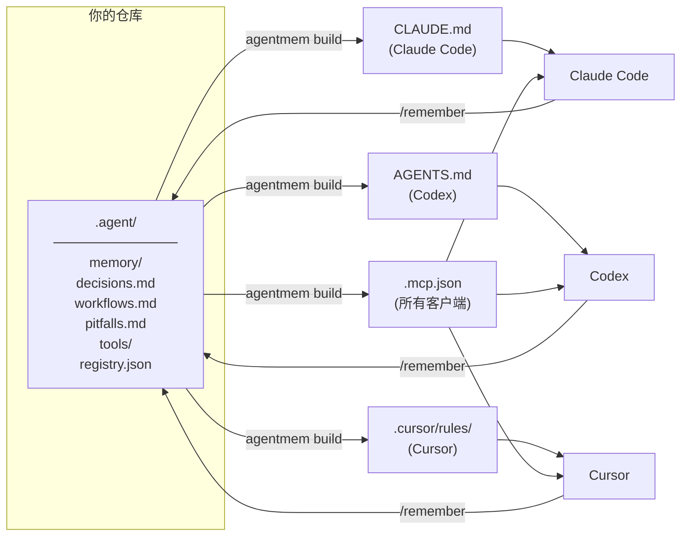

# agentmem

> 一个目录，同步所有 AI 编程助手的记忆。

[](LICENSE)
[](https://www.python.org/)
[]()

[English](README.md) | 中文

---

## 问题

你同时使用 Claude Code、Cursor、Codex。每个工具把项目记忆存在不同地方。换台机器、换个队友、接入新的 AI 工具——又要从头再来。

## 工作原理

`agentmem` 把所有记忆存在一个 Git 同步的 `.agent/` 目录里，自动生成每个工具能读懂的配置文件。AI 助手还可以通过内置 MCP 服务直接读写记忆。



---

## 快速开始

### 方式 A — 直接跟 AI 说话（推荐）

使用 **Claude Code** 或 **Cursor** 时，不需要敲任何命令，直接说：

| 你说什么 | 发生什么 |
|---|---|
| `init memory` | 初始化 `.agent/` 并生成所有平台文件 |
| `记下来` / `remember this` | 把当前对话内容保存到共享记忆 |
| `sync memory` | 提交并推送记忆到 Git |
| `check memory` | 检查记忆系统健康状态 |
| `add skill <名字>` | 创建一个新的共享 skill |

> Claude Code 用户也可以直接输入 `/init-memory`、`/remember`、`/sync-memory`、`/check-memory`、`/add-skill`。

### 方式 B — 命令行

```bash
# 在项目中初始化
python3 agentmem.py init

# 记录一条记忆
python3 agentmem.py remember "这个项目用 pnpm，API 测试需要 Redis。"

# 重新生成所有适配文件
python3 agentmem.py build

# 检查配置是否正确
python3 agentmem.py doctor

# 提交并推送记忆到 Git
python3 agentmem.py sync -m "更新记忆"
```

---

## 内置 Skills

agentmem 内置了五个 skill，在 Claude Code、Cursor、Codex 中均可使用，无需输入命令。

| Skill | 触发短语 | 功能 |
|---|---|---|
| `/init-memory` | "init memory"、"set up agent memory" | 初始化 `.agent/` 并生成平台文件 |
| `/remember` | "记下来"、"remember this"、"save this" | 把对话内容保存到共享记忆 |
| `/check-memory` | "check memory"、"memory status"、"doctor" | 检查记忆系统健康状态 |
| `/sync-memory` | "sync memory"、"push memory" | 构建 → 提交 → 推送到 Git |
| `/add-skill` | "add skill \<名字\>" | 创建新的共享 skill |

---

## 完整命令列表

| 命令 | 说明 |
|---|---|
| `agentmem.py init` | 初始化并生成所有平台文件 |
| `agentmem.py remember "..."` | 记录一条笔记并重新生成 |
| `agentmem.py build` | 从 `.agent/` 重新生成所有适配文件 |
| `agentmem.py doctor` | 检查配置是否同步 |
| `agentmem.py sync -m "msg"` | 构建 → 拉取 → 提交 → 推送 |
| `agentmem.py tool list` | 列出已注册的 MCP 服务 |
| `agentmem.py tool add <name>` | 注册新的 MCP 服务 |

### 添加 MCP 工具

```bash
# stdio 服务
python3 agentmem.py tool add context7 --command npx --arg -y --arg @upstash/context7-mcp

# 从环境变量读取 token 的 HTTP 服务
python3 agentmem.py tool add figma \
  --url https://mcp.figma.com/mcp \
  --bearer-token-env-var FIGMA_OAUTH_TOKEN
```

---

## 内置 MCP 服务

`agentmem` 内置了一个 MCP 服务（`.agent/tools/mcp_server.py`），让 AI 助手可以通过 MCP 协议直接读写共享记忆。

| 工具 | 说明 |
|---|---|
| `agent_memory_read` | 读取一个或所有记忆文件 |
| `agent_memory_search` | 全文搜索记忆 |
| `agent_memory_append` | 写入持久化笔记 |
| `agent_tool_registry` | 读取 MCP 工具注册表 |

---

## 为什么用 Git？

- 记忆跟随仓库，而不是机器。
- 在 CI、新电脑、新队友环境下开箱即用。
- 每次记忆变更都有完整的历史和 diff。
- 不依赖任何第三方服务。

---

## 安全

永远不要把密钥写入 `.agent/`，请使用环境变量引用：

```bash
python3 agentmem.py tool add internal-api \
  --url https://example.com/mcp \
  --bearer-token-env-var INTERNAL_API_TOKEN
```

`.agent/.gitignore` 默认排除本地临时文件和看起来像密钥的文件名。

---

## 路线图

- [x] Git 同步共享记忆
- [x] 自动生成 Claude Code、Cursor、Codex 适配文件
- [x] 内置 MCP 服务
- [x] 共享 MCP 工具注册表
- [x] 内置 Skills（Claude Code、Cursor、Codex）
- [ ] Python SDK（`import agentmem`）
- [ ] 导入已有的 Claude / Cursor / Codex 记忆
- [ ] 大历史记忆压缩
- [ ] `pipx` / Homebrew 打包发布
- [ ] CI 验证用 GitHub Action

---

## 贡献

欢迎提 Issue 和 PR。提交前请运行：

```bash
python3 agentmem.py build
python3 agentmem.py doctor
python3 - <<'PY'
from pathlib import Path
for path in ["agentmem.py", ".agent/tools/mcp_server.py"]:
    compile(Path(path).read_text(), path, "exec")
    print(path, "ok")
PY
```

---

## 许可证

[MIT](LICENSE)
