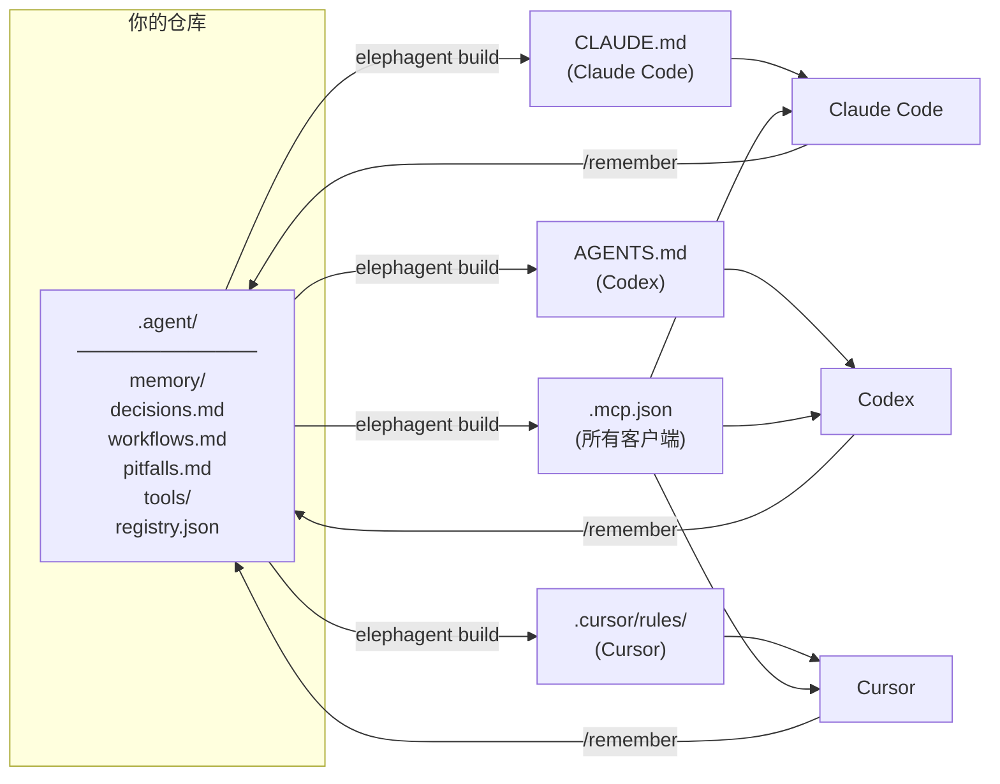

<p align="center">
  
</p>

<h1 align="center">elephagent</h1>

<p align="center">一个目录，同步所有 AI 编程助手的记忆 —— <em>因为大象从不遗忘。</em></p>

<p align="center">
  <a href="https://pypi.org/project/elephagent/"></a>
  <a href="https://pypi.org/project/elephagent/"></a>
  <a href="https://github.com/zhicongsun/elephagent/stargazers"></a>
  <a href="LICENSE"></a>
  <a href="https://www.python.org/"></a>
  
</p>

[English](README.md) | 中文

---

## 问题

你同时使用 Claude Code、Cursor、Codex。每个工具把项目记忆存在不同地方。换台机器、换个队友、接入新的 AI 工具——又要从头再来。

| | 没有 elephagent | 有 elephagent |
|---|---|---|
| **记忆位置** | 分散在 `CLAUDE.md`、`.cursor/rules/`、`AGENTS.md` | 统一存储在 `.agent/`，自动同步到所有平台 |
| **切换工具** | 每个 AI 助手都要从头教起 | 所有助手共享同一份记忆 |
| **新队友加入** | 口口相传项目知识 | `git clone` 即拥有全部上下文 |
| **MCP 服务** | 每个工具单独配置 | 注册一次，全平台可用 |

## 工作原理

`elephagent` 把所有记忆存在一个 Git 同步的 `.agent/` 目录里，自动生成每个工具能读懂的配置文件。AI 助手还可以通过内置 MCP 服务直接读写记忆。



---

<p align="center">
  
</p>

## 安装

```bash
pip install elephagent
```

或使用 pipx（推荐用于全局 CLI 工具）：

```bash
pipx install elephagent
```

---

## 快速开始

### 方式 A — 直接跟 AI 说话（推荐）

使用 **Claude Code** 或 **Cursor** 时，不需要敲任何命令，直接说：

| 你说什么 | 发生什么 |
|---|---|
| `init memory` | 初始化 `.agent/` 并生成所有平台文件 |
| `/el-remember <内容>` | 把内容保存到共享记忆（用斜线命令） |
| `sync memory` | 提交并推送记忆到 Git |
| `check memory` | 检查记忆系统健康状态 |
| `add skill <名字>` | 创建一个新的共享 skill |
| `import memories` | 从其他平台导入已有的记忆和 skills |

> **注意：** 保存记忆请使用 `/el-remember` 斜线命令，而非自然语言——"记下来"等短语可能被 AI 助手内置记忆系统拦截。

### 方式 B — 命令行

```bash
# 在项目中初始化（如果还不是 Git 仓库会自动运行 `git init`）
elephagent init

# 记录一条记忆
elephagent remember "这个项目用 pnpm，API 测试需要 Redis。"

# 重新生成所有适配文件
elephagent build

# 检查配置是否正确
elephagent doctor

# 提交并推送记忆到 Git
elephagent sync -m "更新记忆"
```

---

## 平台配置

运行 `elephagent init` 后，各平台会自动识别配置文件，仅 Cursor 需要一个额外步骤：

| 平台 | 生成的文件 | 额外步骤 |
|---|---|---|
| **Claude Code** | `CLAUDE.md`, `.mcp.json` | 无需配置，开箱即用 |
| **Cursor** | `.cursor/rules/`, `.cursor/mcp.json` | 用 Cursor 打开项目文件夹，会自动检测到 `agent-memory` MCP 服务。如有提示，在 **Settings → Cursor Settings → MCP** 中启用即可 |
| **Codex** | `AGENTS.md`, `.codex/config.toml` | 无需配置，开箱即用 |

---

## 内置 Skills

elephagent 内置了六个 skill，在 Claude Code、Cursor、Codex 中均可使用，无需输入命令。

| Skill | 触发短语 | 功能 |
|---|---|---|
| `/el-init-memory` | "init memory"、"set up agent memory" | 初始化 `.agent/` 并生成平台文件 |
| `/el-remember` | `/el-remember <内容>`（斜线命令） | 把内容保存到共享记忆 |
| `/el-check-memory` | "check memory"、"memory status"、"doctor" | 检查记忆系统健康状态 |
| `/el-sync-memory` | "sync memory"、"push memory" | 构建 → 提交 → 推送到 Git |
| `/el-add-skill` | "add skill \<名字\>" | 创建新的共享 skill |
| `/el-import` | "import memories"、"import skills"、"import from cursor" | 从其他平台导入已有的记忆和 skills |

---

## 完整命令列表

| 命令 | 说明 |
|---|---|
| `elephagent init` | 初始化并生成所有平台文件 |
| `elephagent remember "..."` | 记录一条笔记并重新生成 |
| `elephagent build` | 从 `.agent/` 重新生成所有适配文件 |
| `elephagent import` | 从 Claude Code、Cursor、Codex 导入已有的记忆和 skills |
| `elephagent doctor` | 检查配置是否同步 |
| `elephagent sync -m "msg"` | 构建 → 拉取 → 提交 → 推送 |
| `elephagent tool list` | 列出已注册的 MCP 服务 |
| `elephagent tool add <name>` | 注册新的 MCP 服务 |

### 从已有配置导入

已经有 `CLAUDE.md`、`.cursor/rules/` 或自定义 skills？一条命令即可导入：

```bash
# 自动检测并导入所有平台的记忆和 skills
elephagent import

# 指定来源平台
elephagent import --from claude
elephagent import --from cursor
elephagent import --from codex
```

会扫描手写的记忆文件和自定义 skills，导入到 `.agent/`，然后重新生成所有平台配置。

### 添加 MCP 工具

```bash
# stdio 服务
python3 elephagent.py tool add context7 --command npx --arg -y --arg @upstash/context7-mcp

# 从环境变量读取 token 的 HTTP 服务
python3 elephagent.py tool add figma \
  --url https://mcp.figma.com/mcp \
  --bearer-token-env-var FIGMA_OAUTH_TOKEN
```

---

## 内置 MCP 服务

`elephagent` 内置了一个 MCP 服务（`.agent/tools/mcp_server.py`），让 AI 助手可以通过 MCP 协议直接读写共享记忆。

| 工具 | 说明 |
|---|---|
| `agent_memory_read` | 读取一个或所有记忆文件 |
| `agent_memory_search` | 全文搜索记忆 |
| `agent_memory_append` | 写入持久化笔记 |
| `agent_tool_registry` | 读取 MCP 工具注册表 |

---

## 为什么用 Git？

- 记忆跟随仓库，而不是机器。
- 在 CI、新电脑、新队友环境下开箱即用。
- 每次记忆变更都有完整的历史和 diff。
- 不依赖任何第三方服务。

---

## 安全

永远不要把密钥写入 `.agent/`，请使用环境变量引用：

```bash
python3 elephagent.py tool add internal-api \
  --url https://example.com/mcp \
  --bearer-token-env-var INTERNAL_API_TOKEN
```

`.agent/.gitignore` 默认排除本地临时文件和看起来像密钥的文件名。

---

## 路线图

- [x] Git 同步共享记忆
- [x] 自动生成 Claude Code、Cursor、Codex 适配文件
- [x] 内置 MCP 服务
- [x] 共享 MCP 工具注册表
- [x] 内置 Skills（Claude Code、Cursor、Codex）
- [ ] Python SDK（`import elephagent`）
- [x] 导入已有的 Claude / Cursor / Codex 记忆和 skills
- [ ] 大历史记忆压缩
- [ ] `pipx` / Homebrew 打包发布
- [ ] CI 验证用 GitHub Action

---

## 贡献

欢迎提 Issue 和 PR。提交前请运行：

```bash
python3 elephagent.py build
python3 elephagent.py doctor
python3 - <<'PY'
from pathlib import Path
for path in ["elephagent.py", ".agent/tools/mcp_server.py"]:
    compile(Path(path).read_text(), path, "exec")
    print(path, "ok")
PY
```

---

## 许可证

[MIT](LICENSE)
